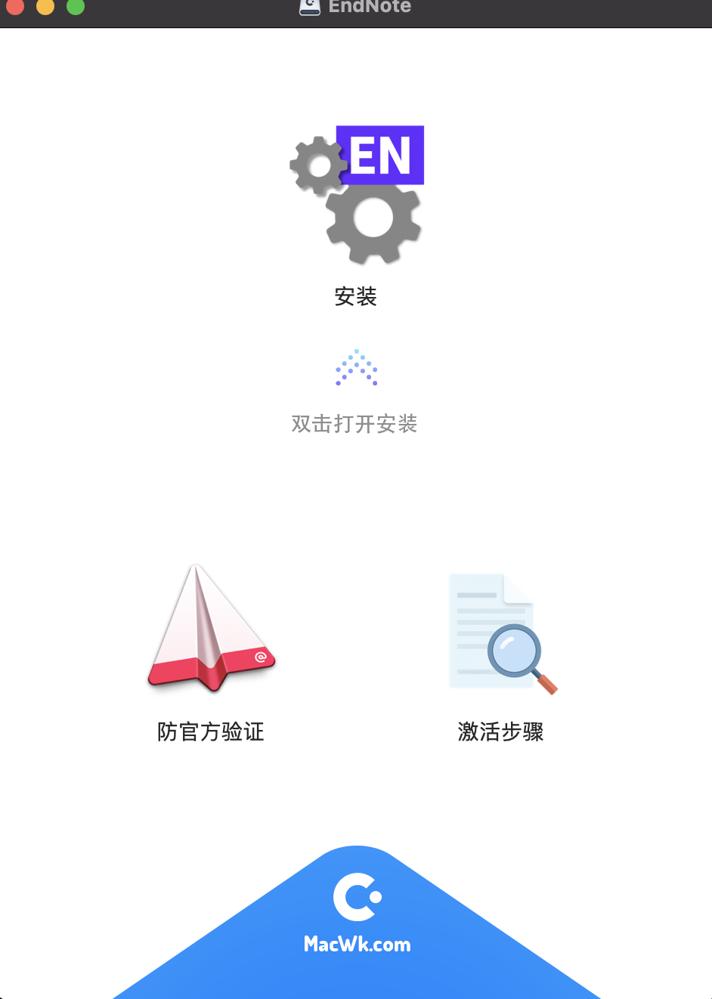

# endNote
 endNote X9 安装步骤

## 第一步：下载 endNote x9.3.3 fixed

[下载链接](https://www.macwk.com/soft/endnote)

## 第二步：安装防官方认证

1. 双击第一步中下载的 dmg.

打开之后如下：

2. 双击防官方验证

3. 如果打不开点击设置中安全性与隐私，允许该软件的打开(根据提示选择仍要打开)。之后按提示输入密码，即可安装成功

4. 点击安装，安装的时候最好让电脑连手机热点。

5. 打开激活步骤，拷贝里面的 product key(第四个我测了，好用)。